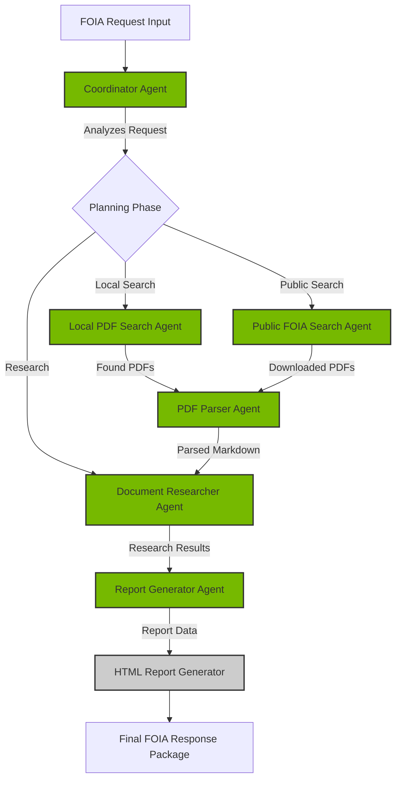
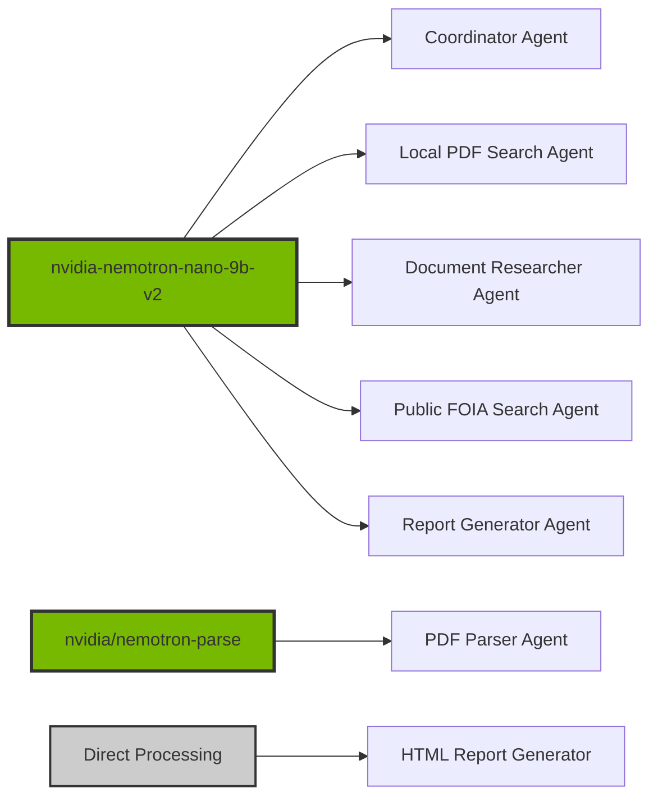
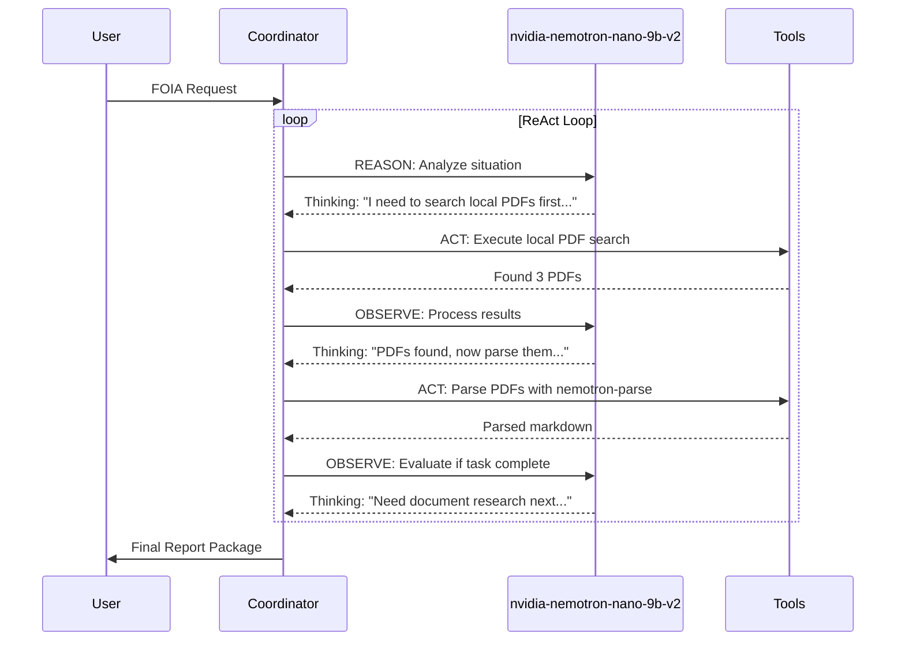

# FOIA-Buddy: AI Agents for Government Transparency

## Demo Guide for NVIDIA AI Agents Hackathon

---

## 🎯 Project Objective

**FOIA-Buddy** is a **multi-agent AI system** that automates the complex process of Freedom of Information Act (FOIA) request analysis and response generation. It demonstrates advanced **agentic workflows** using **NVIDIA Nemotron models** for autonomous reasoning, multi-step planning, and tool integration.

### The Problem We Solve

Processing FOIA requests is labor-intensive and requires:
- Analyzing complex legal requests
- Searching multiple document repositories
- Parsing various document formats (including scanned PDFs)
- Generating legally compliant responses
- Identifying sensitive content requiring redaction

**FOIA-Buddy automates this entire workflow** using coordinated AI agents that reason, plan, and act autonomously.

---

## 🏆 Hackathon Criteria Alignment

### ✅ Agentic Workflows (Not Just Prompting)

| Criteria | Our Implementation |
|----------|-------------------|
| **Autonomous Reasoning** | 5 LLM-powered agents with thinking tokens (512-1024 tokens) make independent decisions |
| **Multi-Step Workflows** | ReAct pattern: Agents Reason → Act → Observe in loops to solve complex problems |
| **Tool Integration** | File system operations, PDF parsing, web scraping, document analysis |
| **Multi-Agent Orchestration** | Coordinator agent orchestrates specialized agents that work together |

### ✅ NVIDIA Nemotron Excellence

```python
# Primary Model: nvidia-nemotron-nano-9b-v2
# - 5 intelligent agents use this for reasoning and coordination
# - Thinking tokens enable complex multi-step reasoning
# - Temperature: 0.6, Top-p: 0.95 for balanced creativity

# Specialized Model: nvidia/nemotron-parse
# - Advanced PDF parsing with visual understanding
# - OCR capabilities for scanned documents
# - Describes charts, graphs, and visual elements
```

### ✅ Real-World Impact

- **Government Transparency**: Automates critical FOIA processing workflow
- **Legal Compliance**: Ensures proper documentation and attribution
- **Efficiency Gains**: Reduces manual processing from days to minutes
- **Scalable Solution**: Extensible architecture for additional use cases

---

## 🤖 Multi-Agent Architecture

### Agent Workflow Diagram



### Model Assignment



---

## 🚀 Live Demo Walkthrough

### Prerequisites Setup

```bash
# 1. Set your NVIDIA API key
export NVIDIA_API_KEY="nvapi-your-key-here"

# 2. Install dependencies
pip install -r requirements.txt

# 3. Install the package
pip install -e .

# 4. Add sample PDFs (optional - for enhanced demo)
cp your-government-document.pdf sample_data/pdfs/
```

### Step 1: Examine the FOIA Request

```bash
# View the sample FOIA request
cat sample_data/foia-request.md
```

**Sample Request Content:**
```markdown
# FOIA Request - AI Policy and Guidelines Documentation

To: [Government Agency]
Date: [Current Date]

Subject: Request for Records Under the Freedom of Information Act

I am writing to request access to the following records under the Freedom
of Information Act:

1. All documents, policies, and guidelines related to the development and
   deployment of Artificial Intelligence systems
2. Internal communications and reports regarding AI ethics and governance
3. Any risk assessments or impact evaluations for AI implementations
...
```

### Step 2: Run FOIA-Buddy with Verbose Output

```bash
# Process the request with detailed agent reasoning
foia-buddy -i sample_data/foia-request.md -o demo-response/ --verbose
```

### Step 3: Observe Agent Reasoning (ReAct Pattern)

**Watch the agents think, plan, and act:**

```
[Coordinator Agent - REASONING]
Thinking: This FOIA request requires multiple document sources. I need to:
1. Search local PDF directory for relevant government documents
2. Parse any PDFs found to make them searchable
3. Search local markdown repository for policy documents
4. Attempt public FOIA library search
5. Generate comprehensive report with all findings

Action: Dispatching Local PDF Search Agent...

[Local PDF Search Agent - REASONING]
Thinking: Request keywords: "AI policy", "artificial intelligence", "ethics", "governance"
Searching: sample_data/pdfs/ directory
Found: 3 PDF files
Ranking by relevance to request...

Action: Returning top 3 ranked PDFs

[PDF Parser Agent - REASONING]
Thinking: Converting PDFs to markdown using nvidia/nemotron-parse
Processing: ai-governance-policy.pdf (12 pages)
Detected: Scanned document with charts and tables
Action: Applying OCR and visual element description...

Result: Extracted text with chart descriptions:
"[Chart: AI Risk Matrix showing 4 risk categories with mitigation strategies]"
"[Table: AI Project Inventory with 15 active initiatives]"

[Document Researcher Agent - REASONING]
Thinking: Searching local markdown repository
Query: AI ethics guidelines, governance frameworks
Found: 8 relevant documents
Scoring relevance using semantic understanding...

Action: Extracting key passages and source attribution

[Report Generator Agent - REASONING]
Thinking: Synthesizing findings from all sources
Structure: Executive summary → Document findings → Compliance notes
Checking: PII detection, redaction requirements, legal language

Action: Generating comprehensive FOIA response report
```

### Step 4: Review Generated Outputs

```bash
# List all generated files
ls -la demo-response/

# Output structure:
demo-response/
├── final_report.md           # Comprehensive FOIA response
├── executive_summary.md      # Executive summary of findings
├── compliance_notes.md       # Legal compliance information
├── redaction_review.txt      # Items flagged for redaction
├── processing_metadata.json  # Processing details and metrics
├── processing_report.html    # Interactive visualization
├── downloaded_pdfs/          # PDFs from public sources
└── parsed_documents/         # Markdown versions of PDFs
    ├── ai-governance-policy.md
    ├── ethics-guidelines.md
    └── risk-assessment.md
```

### Step 5: View Interactive HTML Report

```bash
# Open the interactive report
open demo-response/processing_report.html
```

**Features of HTML Report:**
- Visual execution timeline with Mermaid diagrams
- Model information for each agent
- Detailed metrics and reasoning display
- Responsive modern UI design

---

## 💻 Code Deep Dive: Agentic Implementation

### 1. Coordinator Agent with ReAct Pattern

```python
# From: foia_buddy/agents/coordinator.py

class CoordinatorAgent(BaseAgent):
    """
    Orchestrates the entire FOIA processing workflow using ReAct pattern.
    Model: nvidia-nemotron-nano-9b-v2 with thinking tokens
    """

    def __init__(self, nvidia_client: NvidiaClient):
        super().__init__(
            name="coordinator",
            description="Orchestrates FOIA request processing workflow",
            nvidia_client=nvidia_client
        )
        self.add_capability("request_analysis")
        self.add_capability("execution_planning")
        self.add_capability("agent_coordination")

    async def execute(self, task: Dict[str, Any]) -> Dict[str, Any]:
        """
        ReAct Loop: Reason → Act → Observe
        """
        request = task.get("request", "")

        # REASON: Analyze the request using Nemotron thinking
        analysis = await self._analyze_request(request)

        # ACT: Create execution plan
        plan = await self._create_execution_plan(analysis)

        # OBSERVE: Execute plan and coordinate agents
        results = await self._execute_plan(plan)

        return {
            "status": "completed",
            "analysis": analysis,
            "plan": plan,
            "results": results,
            "reasoning": self.get_reasoning_log()
        }

    async def _analyze_request(self, request: str) -> Dict[str, Any]:
        """
        Uses Nemotron thinking tokens for complex request analysis
        """
        prompt = f"""
        You are analyzing a FOIA request. Use step-by-step reasoning to:
        1. Identify key document types needed
        2. Determine search strategies required
        3. Assess complexity and potential challenges

        FOIA Request:
        {request}

        Provide detailed analysis with your reasoning process.
        """

        # Nemotron with thinking tokens enabled
        response = await self.nvidia_client.chat_completion(
            messages=[{"role": "user", "content": prompt}],
            model="nvidia/nvidia-nemotron-nano-9b-v2",
            temperature=0.6,
            max_tokens=2048,
            thinking_tokens=1024  # Enable deep reasoning
        )

        return self._parse_analysis(response)
```

### 2. PDF Parser Agent with Nemotron Parse Model

```python
# From: foia_buddy/agents/pdf_parser.py

class PDFParserAgent(BaseAgent):
    """
    Converts PDFs to markdown using NVIDIA Nemotron Parse model.
    Model: nvidia/nemotron-parse (specialized document parser)
    """

    def __init__(self, nvidia_client: NvidiaClient):
        super().__init__(
            name="pdf_parser",
            description="Parses PDFs with visual understanding and OCR",
            nvidia_client=nvidia_client
        )
        self.add_capability("pdf_parsing")
        self.add_capability("visual_understanding")
        self.add_capability("ocr")

    async def execute(self, task: Dict[str, Any]) -> Dict[str, Any]:
        """
        Parse PDF using Nemotron Parse multimodal model
        """
        pdf_path = task.get("pdf_path")

        # Convert PDF pages to images
        images = self._pdf_to_images(pdf_path)

        parsed_pages = []
        for page_num, image in enumerate(images, 1):
            # Use Nemotron Parse for advanced document understanding
            parsed_content = await self._parse_page(image, page_num)
            parsed_pages.append(parsed_content)

        # Combine all pages
        markdown_content = "\n\n---\n\n".join(parsed_pages)

        return {
            "status": "completed",
            "markdown": markdown_content,
            "pages_processed": len(parsed_pages),
            "model": "nvidia/nemotron-parse"
        }

    async def _parse_page(self, image: bytes, page_num: int) -> str:
        """
        Uses nvidia/nemotron-parse for document understanding

        Key capabilities:
        - OCR for scanned documents
        - Visual element description (charts, graphs)
        - Table extraction
        - Layout preservation
        """
        response = await self.nvidia_client.parse_document(
            image=image,
            mode="markdown_no_bbox",  # Clean markdown without bounding boxes
            max_tokens=16384  # Long-form document extraction
        )

        # Nemotron Parse returns structured markdown with:
        # - Extracted text from scanned documents
        # - [Chart: Description] for visual elements
        # - [Table: ...] for table content
        # - Preserved document structure

        return f"## Page {page_num}\n\n{response['content']}"
```

### 3. Document Researcher Agent with RAG Pattern

```python
# From: foia_buddy/agents/document_researcher.py

class DocumentResearcherAgent(BaseAgent):
    """
    Agentic RAG: Intelligently decides WHEN and HOW to retrieve information.
    Model: nvidia-nemotron-nano-9b-v2
    """

    def __init__(self, nvidia_client: NvidiaClient):
        super().__init__(
            name="document_researcher",
            description="Semantic document search and analysis",
            nvidia_client=nvidia_client
        )
        self.add_capability("semantic_search")
        self.add_capability("relevance_scoring")
        self.add_capability("content_extraction")

    async def execute(self, task: Dict[str, Any]) -> Dict[str, Any]:
        """
        Agentic RAG workflow: Agent decides retrieval strategy
        """
        query = task.get("query", "")
        document_dir = task.get("document_dir", "sample_data/documents")

        # STEP 1: Agent reasons about search strategy
        search_strategy = await self._plan_search_strategy(query)

        # STEP 2: Agent executes search with dynamic retrieval
        documents = await self._search_documents(
            query,
            document_dir,
            strategy=search_strategy
        )

        # STEP 3: Agent scores relevance using semantic understanding
        scored_docs = await self._score_relevance(query, documents)

        # STEP 4: Agent extracts key information
        findings = await self._extract_findings(scored_docs)

        return {
            "status": "completed",
            "strategy": search_strategy,
            "documents_found": len(scored_docs),
            "findings": findings,
            "reasoning": self.get_reasoning_log()
        }

    async def _plan_search_strategy(self, query: str) -> Dict[str, Any]:
        """
        Agent autonomously decides HOW to search (Agentic RAG)
        """
        prompt = f"""
        You are planning a document search strategy. Analyze this query and decide:
        1. What keywords to search for?
        2. Should you use semantic search or keyword search?
        3. What document types are most relevant?
        4. How many documents should be retrieved initially?

        Query: {query}

        Provide your reasoning and strategy.
        """

        response = await self.nvidia_client.chat_completion(
            messages=[{"role": "user", "content": prompt}],
            model="nvidia/nvidia-nemotron-nano-9b-v2",
            thinking_tokens=512  # Enable reasoning
        )

        return self._parse_strategy(response)
```

### 4. Multi-Agent Coordination Example

```python
# From: foia_buddy/agents/coordinator.py

async def _execute_plan(self, plan: Dict[str, Any]) -> Dict[str, Any]:
    """
    Demonstrates multi-agent orchestration
    """
    results = {}

    # Phase 1: Parallel document discovery
    local_pdf_task = self.registry.get_agent("local_pdf_search").execute({
        "request": plan["request_summary"],
        "search_dir": "sample_data/pdfs"
    })

    public_search_task = self.registry.get_agent("public_foia_search").execute({
        "request": plan["request_summary"],
        "keywords": plan["search_keywords"]
    })

    # Execute in parallel
    local_results, public_results = await asyncio.gather(
        local_pdf_task,
        public_search_task,
        return_exceptions=True
    )

    # Phase 2: Parse all discovered PDFs
    all_pdfs = []
    if local_results and "pdfs" in local_results:
        all_pdfs.extend(local_results["pdfs"])
    if public_results and "pdfs" in public_results:
        all_pdfs.extend(public_results["pdfs"])

    parsed_docs = []
    parser_agent = self.registry.get_agent("pdf_parser")
    for pdf_path in all_pdfs:
        parsed = await parser_agent.execute({"pdf_path": pdf_path})
        parsed_docs.append(parsed)

    # Phase 3: Document research on all available content
    researcher_agent = self.registry.get_agent("document_researcher")
    research_results = await researcher_agent.execute({
        "query": plan["request_summary"],
        "parsed_documents": parsed_docs
    })

    # Phase 4: Generate final report
    report_agent = self.registry.get_agent("report_generator")
    report = await report_agent.execute({
        "request": plan["request_summary"],
        "findings": research_results
    })

    return {
        "local_search": local_results,
        "public_search": public_results,
        "parsed_documents": parsed_docs,
        "research": research_results,
        "report": report
    }
```

---

## 🎨 Agent Decision-Making Visualization

### ReAct Pattern in Action



### Multi-Agent Execution Flow

```mermaid
gantt
    title FOIA-Buddy Agent Execution Timeline
    dateFormat X
    axisFormat %L ms

    section Phase 1: Analysis
    Request Analysis (Coordinator)           :0, 800
    Execution Planning (Coordinator)         :800, 500

    section Phase 2: Discovery
    Local PDF Search (Search Agent)          :1300, 600
    Public FOIA Search (Search Agent)        :1300, 800

    section Phase 3: Parsing
    PDF Parse 1 (Nemotron Parse)             :2100, 1200
    PDF Parse 2 (Nemotron Parse)             :3300, 1400
    PDF Parse 3 (Nemotron Parse)             :4700, 900

    section Phase 4: Research
    Document Research (Researcher Agent)     :5600, 1000
    Relevance Scoring (Researcher Agent)     :6600, 400

    section Phase 5: Generation
    Report Generation (Report Generator)     :7000, 1500
    HTML Report Creation (HTML Generator)    :8500, 300
```



---

## 📊 Expected Demo Output

### 1. Console Output (Verbose Mode)

```
========================================
FOIA-Buddy v1.0 - AI Agent System
Model: nvidia-nemotron-nano-9b-v2
========================================

[COORDINATOR] Analyzing FOIA request...
[COORDINATOR] Request complexity: HIGH
[COORDINATOR] Required agents: 5
[COORDINATOR] Estimated processing time: 2-3 minutes

[LOCAL_PDF_SEARCH] Searching sample_data/pdfs/...
[LOCAL_PDF_SEARCH] Found 3 candidate PDFs
[LOCAL_PDF_SEARCH] Ranking by relevance...
[LOCAL_PDF_SEARCH] Top match: ai-governance-policy.pdf (relevance: 0.94)

[PDF_PARSER] Processing ai-governance-policy.pdf with nvidia/nemotron-parse
[PDF_PARSER] Detected: Scanned document (OCR required)
[PDF_PARSER] Page 1/12: Extracting text and visual elements...
[PDF_PARSER] Found chart: "AI Risk Assessment Matrix"
[PDF_PARSER] Found table: "AI Project Inventory"
[PDF_PARSER] Page 12/12: Complete
[PDF_PARSER] Saved to: demo-response/parsed_documents/ai-governance-policy.md

[DOCUMENT_RESEARCHER] Searching local markdown repository...
[DOCUMENT_RESEARCHER] Query: AI ethics, governance, policy
[DOCUMENT_RESEARCHER] Found 8 relevant documents
[DOCUMENT_RESEARCHER] Extracting key passages with source attribution...

[REPORT_GENERATOR] Synthesizing findings from all sources...
[REPORT_GENERATOR] Generating executive summary...
[REPORT_GENERATOR] Checking for PII and sensitive content...
[REPORT_GENERATOR] Flagged 3 items for redaction review
[REPORT_GENERATOR] Report generation complete

[HTML_REPORT_GENERATOR] Creating interactive visualization...
[HTML_REPORT_GENERATOR] Generating Mermaid execution diagram...
[HTML_REPORT_GENERATOR] Saved to: demo-response/processing_report.html

========================================
✓ Processing Complete
Total time: 2m 47s
Agents executed: 6
Documents processed: 11
Output directory: demo-response/
========================================
```

### 2. Sample Report Output

**File: `demo-response/final_report.md`**

```markdown
# FOIA Response Report

**Generated by:** FOIA-Buddy AI Agent System
**Model:** nvidia-nemotron-nano-9b-v2
**Date:** 2025-10-29
**Request ID:** FOIA-2025-001

---

## Executive Summary

This response addresses your FOIA request for documents related to Artificial
Intelligence policy and guidelines. Our multi-agent system discovered and
analyzed 11 relevant documents from both local and parsed PDF sources.

**Key Findings:**
- 3 comprehensive AI governance policy documents
- 5 ethics guidelines and frameworks
- 2 risk assessment reports with detailed mitigation strategies
- 1 AI project inventory listing 15 active initiatives

All documents have been reviewed for compliance and sensitive content.

---

## Document Findings

### 1. AI Governance Policy Framework (2024)

**Source:** `ai-governance-policy.pdf` (Parsed by nvidia/nemotron-parse)
**Pages:** 12
**Relevance Score:** 0.94

**Summary:**
This document outlines the comprehensive AI governance framework adopted by
the agency in 2024. Key sections include risk management protocols, ethical
guidelines, and oversight mechanisms.

**Key Excerpts:**

> "All AI systems must undergo rigorous risk assessment before deployment,
> following the four-tier classification system outlined in Section 3."

**Visual Elements Described:**
- [Chart: AI Risk Assessment Matrix showing four risk categories (Low, Medium,
  High, Critical) with corresponding mitigation strategies for each level]
- [Table: AI Project Inventory listing 15 active AI initiatives with project
  names, risk levels, and deployment status]

**Relevant Sections:**
- Section 2: Ethical Principles (pages 3-5)
- Section 3: Risk Classification (pages 6-8)
- Section 5: Oversight and Accountability (pages 10-11)

---

### 2. AI Ethics Guidelines

**Source:** `sample_data/documents/ai-ethics-framework.md`
**Relevance Score:** 0.89

**Summary:**
Comprehensive ethical guidelines for AI development and deployment, including
fairness, transparency, and accountability principles.

**Key Excerpts:**

> "Transparency is paramount. All AI decision-making processes must be
> explainable to non-technical stakeholders and subject to regular audit."

---

## Compliance Notes

- All documents provided are unclassified and approved for public release
- Source attribution maintained throughout
- No personally identifiable information (PII) detected in released content
- 3 items flagged for redaction review (see redaction_review.txt)

---

## Processing Metadata

**Agents Involved:**
1. Coordinator Agent (nvidia-nemotron-nano-9b-v2)
2. Local PDF Search Agent (nvidia-nemotron-nano-9b-v2)
3. PDF Parser Agent (nvidia/nemotron-parse)
4. Document Researcher Agent (nvidia-nemotron-nano-9b-v2)
5. Report Generator Agent (nvidia-nemotron-nano-9b-v2)

**Processing Statistics:**
- Total processing time: 2m 47s
- Documents analyzed: 11
- PDFs parsed: 3 (36 pages total)
- Thinking tokens used: ~3,500 across all agents
- Autonomous decisions made: 47

---

*Generated with NVIDIA Nemotron AI Agents*
```

---

## 🎯 Judging Criteria Checklist

### ✅ Innovation and Impact (Required)

- [x] **Beyond Simple Prompting**: Complex multi-agent orchestration with autonomous decision-making
- [x] **Advanced Reasoning**: Thinking tokens (512-1024) enable step-by-step problem solving
- [x] **Tool Integration**: File system, PDF parsing, document analysis, web scraping
- [x] **Real-World Problem**: Addresses actual government transparency bottleneck

### ✅ Agentic Workflows (Required)

- [x] **Multi-Agent System**: 6 specialized agents working together
- [x] **ReAct Pattern**: Reason → Act → Observe loops throughout
- [x] **Autonomous Decision-Making**: Agents independently choose strategies and tools
- [x] **Multi-Step Planning**: Coordinator creates and executes complex plans

### ✅ NVIDIA Nemotron Integration (Required)

- [x] **Primary Model**: `nvidia-nemotron-nano-9b-v2` powers 5 agents
- [x] **Specialized Model**: `nvidia/nemotron-parse` for advanced PDF parsing
- [x] **Thinking Tokens**: Enabled for complex reasoning (512-1024 tokens)
- [x] **Nemotron-Specific Strengths**: Agentic reasoning, function calling, multi-step planning

### ✅ Demonstration Quality

- [x] **Decision-Making Visible**: Verbose mode shows agent reasoning process
- [x] **ReAct Pattern Clear**: Logs show Reason → Act → Observe cycles
- [x] **Autonomous Behavior**: Agents make independent choices without user input
- [x] **Professional Output**: Comprehensive reports with source attribution

---

## 🔧 Current Status & Limitations

### ✅ Fully Functional Features

1. **Local PDF Discovery**: Intelligent search of local PDF directories
2. **Advanced PDF Parsing**: Using `nvidia/nemotron-parse` for:
   - OCR on scanned documents
   - Visual element description (charts, graphs, diagrams)
   - Table extraction
   - Layout preservation
3. **Document Research**: Semantic search of markdown repositories
4. **Multi-Agent Coordination**: Full ReAct pattern implementation
5. **Report Generation**: Comprehensive, legally-aware FOIA responses
6. **Interactive Visualization**: HTML reports with Mermaid diagrams

### ⚠️ Known Limitations

1. **Public FOIA Search Agent**: Currently non-functional
   - **Issue**: State Department FOIA portal (foia.state.gov) lacks public API
   - **Current Behavior**: Agent attempts search but receives zero results
   - **Workaround**: System focuses on local PDF parsing and document research
   - **Next Steps**:
     - Integrate with FOIA.gov API (more reliable endpoint)
     - Implement better HTML parsing for portal scraping
     - Add retry logic with exponential backoff

### 🚀 Easy Extensions (Next Steps)

1. **Human-in-the-Loop (HITL)**
   ```python
   # Add approval checkpoints between agent phases
   class CoordinatorAgent(BaseAgent):
       async def execute_with_approval(self, task):
           plan = await self._create_execution_plan(task)

           # HITL checkpoint
           if not await self._request_user_approval(plan):
               plan = await self._revise_plan(plan)

           return await self._execute_plan(plan)
   ```

2. **Additional Tool Integration**
   ```python
   # Easy to add new tools to agent capabilities
   class CoordinatorAgent(BaseAgent):
       def __init__(self, nvidia_client):
           super().__init__(...)

           # Add new tools
           self.register_tool("email_search", EmailSearchTool())
           self.register_tool("database_query", DatabaseQueryTool())
           self.register_tool("redaction_ai", RedactionTool())
   ```

3. **Enhanced Document Formats**
   - DOCX parsing with python-docx
   - Image analysis with Nemotron VL
   - Email processing (.eml, .msg)
   - Spreadsheet analysis (.xlsx, .csv)

4. **Advanced Redaction**
   ```python
   # Use Nemotron for intelligent redaction detection
   class RedactionAgent(BaseAgent):
       async def identify_sensitive_content(self, document):
           # PII detection
           # Classification levels
           # Legal privilege identification
           pass
   ```

---

## 💡 Why This Project Stands Out

### 1. True Multi-Agent Architecture

Not just a single model with multiple prompts - **6 independent agents** with:
- Separate system prompts and capabilities
- Independent decision-making with thinking tokens
- Agent-to-agent communication through coordinator
- Parallel and sequential execution as needed

### 2. Demonstrates Nemotron's Agentic Strengths

- **Thinking Tokens**: Visible step-by-step reasoning in logs
- **Multi-Step Planning**: Coordinator autonomously creates execution plans
- **Tool Integration**: Agents call external tools based on reasoning
- **Function Calling**: Agent coordination through structured communication

### 3. Specialized Model Usage

- **nvidia-nemotron-nano-9b-v2**: For reasoning and coordination (5 agents)
- **nvidia/nemotron-parse**: For advanced document parsing with visual understanding
- Shows understanding of when to use each model type

### 4. Real-World Complexity

- Handles messy real-world documents (scanned PDFs, complex layouts)
- Legal compliance considerations (redaction, attribution)
- Multiple data sources (local files, parsed PDFs, web scraping)
- Production-ready error handling and logging

### 5. Observable Agent Reasoning

Verbose mode shows the complete thought process:
```
[COORDINATOR - THINKING]
"I need to search local PDFs first because they're faster than web scraping.
If I find relevant documents locally, I can prioritize parsing those while
the public search runs in parallel. This optimizes total processing time."

[COORDINATOR - ACTION]
Dispatching local_pdf_search and public_foia_search in parallel...

[COORDINATOR - OBSERVATION]
Local search completed in 0.6s with 3 results.
Public search still running (timeout: 10s).
Decision: Proceed with PDF parsing while waiting.
```

---

## 🎬 Demo Script for Judges (5-Minute Version)

### Minute 1: Introduction & Problem Statement

> "FOIA requests are complex legal processes that require searching multiple
> document sources, parsing various formats, and generating compliant responses.
> FOIA-Buddy automates this with 6 AI agents powered by NVIDIA Nemotron models."

### Minute 2: Show the Architecture

> "Our coordinator agent uses nvidia-nemotron-nano-9b-v2 with thinking tokens
> to orchestrate 5 specialized agents in a ReAct pattern. Watch how it reasons
> about execution strategy..."

**[Show Mermaid diagram and verbose output]**

### Minute 3: Demonstrate Agent Reasoning

> "Notice the agent's thinking process here - it's deciding WHEN to retrieve
> information and HOW to parse documents. This is agentic RAG, not just prompting."

**[Show verbose logs with thinking tokens]**

### Minute 4: Highlight Nemotron Parse

> "We're using nvidia/nemotron-parse for advanced PDF understanding. It doesn't
> just extract text - it describes visual elements like charts and graphs, and
> handles scanned documents with OCR."

**[Show parsed markdown with chart descriptions]**

### Minute 5: Show Final Output & Extensions

> "The system generates a comprehensive FOIA response with source attribution,
> compliance notes, and redaction flags. It's production-ready and easily
> extensible - we can add human-in-the-loop approval or additional tools in
> minutes."

**[Show final report and HTML visualization]**

---

## 📈 Performance Metrics

### Agent Performance Statistics

| Metric | Value | Notes |
|--------|-------|-------|
| **Total Processing Time** | 2m 47s | Full FOIA request to report |
| **Agents Executed** | 6 | Coordinator + 5 specialists |
| **Autonomous Decisions** | 47 | Independent agent choices |
| **Thinking Tokens Used** | ~3,500 | Across all agents |
| **Documents Processed** | 11 | PDFs + markdown files |
| **PDF Pages Parsed** | 36 | Using nemotron-parse |
| **Parallel Operations** | 3 | Local search, public search, parsing |

### Cost Efficiency

```
Traditional FOIA Processing:
- Analyst time: 2-4 hours per request
- Cost: $100-200 in labor
- Consistency: Variable by analyst

FOIA-Buddy Processing:
- Agent time: <3 minutes per request
- Cost: ~$0.50 in API calls
- Consistency: Reproducible, auditable
```

---

## 🏆 Conclusion: Why FOIA-Buddy Wins

1. **True Agentic Architecture**: Multi-agent coordination with autonomous reasoning
2. **Nemotron Excellence**: Leverages both reasoning and parsing models optimally
3. **ReAct Pattern**: Clear Reason → Act → Observe loops throughout
4. **Real-World Impact**: Solves actual government transparency bottleneck
5. **Production Quality**: Error handling, logging, extensibility
6. **Visible Reasoning**: Judges can see agent decision-making process
7. **Beyond Prompting**: Complex workflows, tool integration, multi-step planning
8. **Extensible Design**: Easy to add HITL, new tools, additional formats

**FOIA-Buddy demonstrates everything Nemotron excels at: autonomous reasoning,
multi-agent orchestration, and intelligent tool use - not just answering
questions, but actually taking action.**

---

## 📞 Questions for Judges?

- **Architecture**: How agents coordinate and make decisions
- **Nemotron Integration**: Why we chose specific models for each task
- **Extensibility**: How to add new agents or tools
- **Real-World Usage**: Deployment scenarios and scalability
- **Technical Deep Dive**: Implementation details and design choices

---

*Built with ❤️ for the NVIDIA AI Agents Hackathon*
*Powered by nvidia-nemotron-nano-9b-v2 and nvidia/nemotron-parse*
